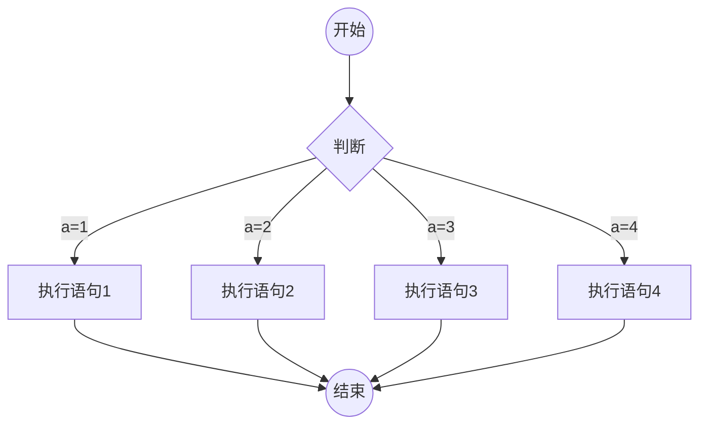

### Test

```go
func main(){
    fmt.Println("wtf")
}
```


```mermaid
graph TD
    B((开始)) -->C{判断}
    C --  a=1 -->D[执行语句1]
    C --  a=2  -->E[执行语句2]
    C --  a=3 -->F[执行语句3]
    C -- a=4  -->G[执行语句4]
    D--> AA((结束))
    E--> AA
    F--> AA
   G--> AA      
```